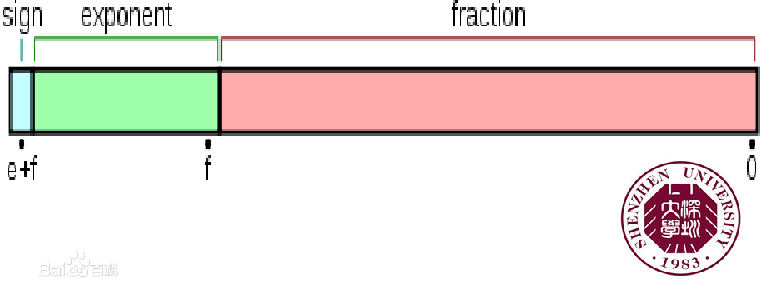
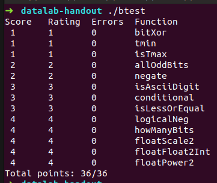
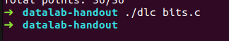
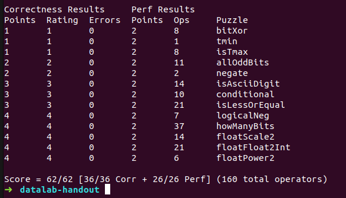

#	CSAPP-Lab1:Data Lab

**姓名**：龚***

**学号**：PB17***8

## 摘要

本报告是对**计算机系统详解**课程课后实验----**CSAPP相关实验**的实验思路汇总以及心得体会报告。这次完成的实验是Data Lab，主要考察对**integer**和**float**在计算机中的**bits-level**表示方式的掌握程度以及C语言的位操作和逻辑操作。

> **INTRODUCTION**
>
> The purpose of this assignment is to become more familiar with bit-level representations  of integers andfloating point numbers. You’ll do this by solving a series of programming “puzzles.” Many of these puzzlesare quite artificial,  but you’ll find yourself  thinking much more about bits in working your way throughthem.

##  实验任务

在一个严格限制的C子集（使用优先的位运算符以及顺序结构的代码）中实现简单的逻辑，补码以及浮点数相关的函数。

##	实验解答

### Part1 整型部分

**int数据在计算机中的表示方式**：integer在计算机中的存储用2进制的补码表示,最高位为符号位，0代表整数，1代表负数

**Challenge1：**

>  * bitXor - x^y using only ~ and & 
>  * Example: bitXor(4, 5) = 1
>  * Legal ops: ~ &
>  * Max ops: 14
>  * Rating: 1

实验1是只用**~ &** 完成 **^**，由逻辑操作之间的关系我们有 **a^b = ab^c^ + a^c^b =( ( ab^c^ )^c^  ( a^c^b )^c^ )^c^**

所以实现为:

```c
int bitXor(int x, int y) {
  return ~((~(x & (~y)))&(~((~x)&y)));
}
```

**Challenge2:**

>  * tmin - return minimum two's complement integer 
>  * Legal ops: ! ~ & ^ | + << >>
>  * Max ops: 4
>  * Rating: 1

我们知道int在计算机中用二进制补码表示，最高位为符号位，由此可以知道对int32能表示的范围，最小的数是**0x80000000**，所以只需把1右移31位

```c
int tmin(void) {
  return 1<<31;
}
```

**Challenge3:**

>  * isTmax - returns 1 if x is the maximum, two's complement number,and 0 otherwise 
>  * Legal ops: ! ~ & ^ | +
>  * Max ops: 10
>  * Rating: 1

根据int在计算机中的表示形式，对int32而言，最大数为**0x7FFFFFFFF**。对最大数而言可以通过右移再加上1即可变为**0xFFFFFFFF**，但还有也仅有**0xFFFFFFFF**也可以通过相同操作变为**0xFFFFFFFF**。所以采用这种方法检验只需排除**0xFFFFFFFF**。而0xFFFFFFFF检验只需取反即可。

```c
int isTmax(int x) {
  int test1 = !!(~x); //if x = 0xFFFFFFFF，test1 = 0， else test1 = 1  
  int test2 = ~(x + x + 1); // 用x+x实现右移，检验是否是0x7FFFFFFF
  return !test2 & test1;
}
```

**Challenge4:**

>  * allOddBits - return 1 if all odd-numbered bits in word set to 1 where bits are numbered from 0 (least significant) to 31 (most significant)
>  * Examples allOddBits(OxFFFFFFFD) = 0, allOddBits(0xAAAAAAAA) = 1
>  * Legal ops: ! ~ & ^ | + << >>
>  * Max ops: 12
>  * Rating: 2

若某个int32符合条件，其必然含有**0xAAAAAAAA**，所以我们只需检验**0xAAAAAAAA**。

而仅有**0xAAAAAAAA**满足 **((num<<1) + num+ 2) = 0**。

```c
int allOddBits(int x) {
   int num = 0xAA;
   int test = (num<<8 | num<<16 | num<<24 | num) & x; //检验x中是否含有0xAAAAAAAA
   return !((test<<1) + test + 2);
}
```

**Challenge5：**

>  * negate - return -x 
>  * Example: negate(1) = -1.
>  * Legal ops: ! ~ & ^ | + << >>
>  * Max ops: 5
>  * Rating: 2

​     我们知道**-x = ~ x + 1**，所以

```c
int negate(int x) {
  return (~x + 1);
}
```

**Challenge6:**

>  * isAsciiDigit - return 1 if Ox30 <= x <= 0x39 (ASCII codes for characters '0' to '9')
>
>  * Example: isAsciiDigit(Ox35) = 1.
>
>    ​                  isAsciiDigit(Ox3a) = 0.
>
>    ​                  isAsciiDigit(Ox05) = 0.
>
>  * Legal ops: ! ~ & ^ | + << >>
>
>  * Max ops: 15
>
>  * Rating: 3

如果一个数是**AsciiDigit**，则它只有**最低六位是有效的**，其他都是0。

并且形式为**6`b11X^1^X^2^X^3^X**，并且**X^1^和X^2^不能同时为1**，**X^1^和X^3^不能同时为1**。

这里我们分三步进行检验：

1. 检验是除最低六位外是否都是0
2. 检验是否是介于0x30 ~ 0x3F之间
3. 检验是否是介于0x30 ~ 0x39 之间

```C
int isAsciiDigit(int x) {
  int test_is = (~0x3F) & x; 
  int test_is3X = 0x00000030 & (~x); 
  int test_is0T9 = !(0x0000000A & (~x)) | !(0x0000000C & (~x));  
  return !(test_is | test_is3X | test_is0T9);
}
```

**Challenge7:**

>  * conditional - same as x ? y : z 
>  * Example: conditional(2,4,5) = 4
>  * Legal ops: ! ~ & ^ | + << >>
>  * Max ops: 16
>  * Rating: 3

这里我们利用test来存储信息，如果**x=0，则test=0，否则x!=0，则test=0xFFFFFFFF**

然后 **(test & y) | ((~test) & z)** 即可完成我们的任务。

```C
int conditional(int x, int y, int z) {
  int test = (~(!x)) + !x + !x;
  return (test & y) | ((~test) & z);
}
```

**Challenge8:**

>  * isLessOrEqual - if x <= y  then return 1, else return 0 
>  * Example: isLessOrEqual(4,5) = 1.
>  * Legal ops: ! ~ & ^ | + << >>
>  * Max ops: 24
>  * Rating: 3

我们利用取反加一计算**y - x**，若 **y - x > = 0**, 可以由此判断y>=x是否成立

但是我们要小心**溢出**，所以先要**检测符号**。会发生溢出的情况是**y正x负**或者**y负x正**，其中y正x负也是符合条件的。

```C
int isLessOrEqual(int x, int y) {
  int num = 1<<31; //用处检测正负
  int test1 = (!(num & y)) & !!(num  & x); // test1 = 1 if y >= 0 and x < 0 
  int test2 = !!(num & y) & (!(num  & x)); //  test2 = 1 if x >=0 and y < 0
  int temp = (~x + 1) + y; // temp = y - x
  int result = num  & temp; // result = 0 if y-x>=0
  return (!test2) & (test1 | !result);
}
```

**Challenge9:**

>  * logicalNeg - implement the ! operator, using all of the legal operators except !
>  * Examples: logicalNeg(3) = 0, logicalNeg(0) = 1
>  * Legal ops: ~ & ^ | + << >>
>  * Max ops: 12
>  * Rating: 4 

这里我们可以利用**0加一仍然是0**来进行判断。只有0满足 **（~x）& (~(-x))** 的符号位为0。

```c
int logicalNeg(int x) {
  int y = ~x + 1;
  return (((~y) & (~x))>>31) & 1; 
}
```

**Challenge10:**

>  * howManyBits - return the minimum number of bits required to represent x in two's complement
>
>  * Examples: howManyBits(12) = 5
>
>    ​		   howManyBits(298) = 10
>
>    ​                   howManyBits(-5) = 4
>
>    ​                   howManyBits(0)  = 1
>
>    ​                   howManyBits(-1) = 1
>
>    ​                   howManyBits(Ox80000000) = 32
>
>  * Legal ops: ! ~ & ^ | + << >>
>
>  * Max ops: 90
>
>  * Rating: 4

这道题目比较难，我参考晚上答案才做出来，利用**二分法**来判断。

```C
nt howManyBits(int x) {
  int temp=x^(x>>31);//get positive of x;
  int isZero=!temp;
//notZeroMask is 0xffffffff
  int notZeroMask=(!(!temp)<<31)>>31;
  int bit_16,bit_8,bit_4,bit_2,bit_1;
  bit_16=!(!(temp>>16))<<4;
//see if the high 16bits have value,if have,then we need at least 16 bits
//if the highest 16 bits have value,then rightshift 16 to see the exact place of 
//if not means they are all zero,right shift nothing and we should only consider the low 16 bits
  temp=temp>>bit_16;
  bit_8=!(!(temp>>8))<<3;  
  temp=temp>>bit_8;
  bit_4=!(!(temp>>4))<<2;
  temp=temp>>bit_4;
  bit_2=!(!(temp>>2))<<1;
  temp=temp>>bit_2;
  bit_1=!(!(temp>>1));
  temp=bit_16+bit_8+bit_4+bit_2+bit_1+2;//at least we need one bit for 1 to tmax,
//and we need another bit for sign
  return isZero|(temp&notZeroMask);
}
```

### Part2 浮点部分

float32简介：32为浮点数以下图的形式来表示，其中最高位为符号位，接下来的8位为指数位，剩下的23位为有效位。

详细介绍：[IE754](https://en.wikipedia.org/wiki/IEEE_754)



| 形式       | 指数      | 小数部分 |
| ---------- | --------- | -------- |
| 零         | 0         | 0        |
| 非规约形式 | 0         | 非0      |
| 规约形式   | 1到2^e^-2 | 任意     |
| 无穷       | 2^e^-1    | 0        |
| NaN        | 2^e^-1    | 非零     |

**Challenge11:**

>  * floatScale2 - Return bit-level equivalent of expression 2*f for floating point argument f. Both the argument and result are passed as unsigned int's, but they are to be interpreted as the bit-level representation of single-precision floating point values. When argument is NaN, return argument
>  * Legal ops: Any integer/unsigned operations incl. ||, &&. also if, while
>  * Max ops: 30
>  * Rating: 4

这里主要要分**三种情况**

- 如果exponent = 255 则表示无穷或者NaN 此时返回原参数。
- 如果exponent = 0 则表示非规约情况，整数部分为0。
- 如果exponent = others, 则表示规约情况

```c
unsigned floatScale2(unsigned uf) {
  unsigned result;
  unsigned index = 0xFF & (uf>>23); //提出指数部分
  unsigned s = uf>>31; //提取符号位
  unsigned fraction = uf & 0x7FFFFF; //提出fraction部分
  if ( index == 0 ) result = s<<31 | (fraction + fraction); //非规约情况
  else if ( index == 255) result = uf; //无穷或者NaN
  else result = s<<31 | (index+1) << 23 | fraction;  //规约情况
  return result;
}
```

**Challenge12:**

>  * floatFloat2Int - Return bit-level equivalent of expression (int) f for floating point argument f. Argument is passed as unsigned int, but it is to be interpreted as the bit-level representation of a single-precision floating point value. Anything out of range (including NaN and infinity) should return Ox80000000u.
>  * Legal ops: Any integer/unsigned operations incl. ||, &&. also if, while
>  * Max ops: 30
>  * Rating: 4

- 这里我们只需要注意int32范围为**-2^-31^ ~ 2^31^-1**, 指数部分为**-31到31**，对应float32 指数部分为**96 ~ 158**。但是要注意但**float32 指数部分小于127时表示的数小于1**，转换到int时会被**截尾变成0**。

  所以同样可以划分为**3部分**：

  - index > 158，return 0x80000000u
  - index < 127，return 0
  - otherwise，需要转化

  ```c
  int floatFloat2Int(unsigned uf) {
  	unsigned result;
  	int index = (0xFF<<23 & uf) >> 23;
  	unsigned s = uf >> 31;
  	if( index > 158 ) result = 0x80000000;
  	else if ( index < 127 ) result = 0;
  	else if (!s){
  		if ( index > 150 ) result = (0x800000)<<(index - 150);
  		else result = (0x800000)>>(150 - index);
  	}
  	else{
  		if ( index > 150 ) result = ~(0x800000)<<(index - 150) + 1;
  		else result = ~(0x800000)>>(150 - index) + 1;
  	}
    return result;
  }
  ```

**Challenge12:**

> - floatPower2 - Return bit-level equivalent of the expression 2.0^x (2.0 raised to the power x) for any 32-bit integer x.The unsigned value that is returned should have the identical bit representation as the single-precision floating-point number 2.0^x. If the result is too small to be represented as a denorm, return If too large, return +INF.
> - Legal ops: Any integer/unsigned operations incl. ||, &&. Also if, while 
> - Max ops: 30 
> - Rating: 4

float32的指数部分表示范围为**0 ~ 255**，实际表示范围**-127 ~ 128**，同时float32还有**非规约情况**。所以同样也要分4种情况

- x > 128, float32无法表示，return +INF
- x <-127, float32无法表示，return 0
- x = 0，return 0x3F800000
- otherwise, 正常转化

```c
unsigned floatPower2(int x) {
	unsigned result;
	if (x > 128) result = 0x7F800000;
	else if (x < -127) result = 0;
	else if (x == 0) result = 0x3F800000;
	else result = ((x + 127)<<23); 
    return result;
}
```

##	正确性和规范性检查

这里我们利用自带的checkunit工具进行检查

首先是**正确性**：



其次是**规范性**：



没有发现非法字符

**总得分**：



##	实验心得

本次实验，我非常深入理解了float型和int型再计算机种的表示方式。尤其是float型，采用IE754。虽然以前对IE754就有一定的了解，但是只了解规约形式，对非规约以及NaN和INF的表示不是非常清楚。另外在了解IE754的过程中也知道了NaN的特殊性。
