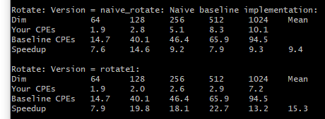
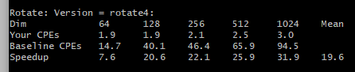
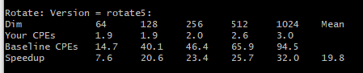
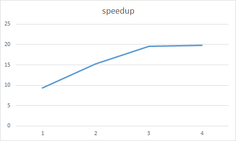

#	CSAPP-Lab2:PerfLab

姓名：龚***

学号：PB17***8

## 摘要

本报告是对**计算机系统详解**课程课后实验----**CSAPP相关实验**的**实验过程记录**以及**心得体会报告**。这次完成的实验是PerLab，考察的是对体系结构的理解程度，综合运用各种能力加速程序。

> INTRODUCTION
>
> This assignment deals with optimizing memory intensive code. Image processing offers many examples offunctions that can benefit from optimization. In this lab, we will consider two image processing operations:rotate, which rotates an image counter-clockwise by90◦, andsmooth, which “smooths” or “blurs” animage.

## 实验任务

完成对**rotate函数**和**smooth函数**的优化

> rotate function: rotate an image counter-clockwise by 90◦


> smooth function:  “smooth” or “blur” animage.
>
> The smooth operation is implemented by replacing every pixel value with the average of all the pixelsaround it.


##  实验过程

### Part1: rotate function optimization

原函数

```c
#define RIDX(i,j,n) ((i)*(n)+(j))
void naive_rotate(int dim, pixel *src, pixel *dst) 
{
    int i, j;
    for (i = 0; i < dim; i++)
	for (j = 0; j < dim; j++)
	    dst[RIDX(dim-1-j, i, dim)] = src[RIDX(i, j, dim)];
}
```

这是一个比较常规**类转置操作**，对**caches命中**比较敏感。

* 这里我们可以先测试下，是对src按行顺序读、对dst按列写性能好，还是对src按列读，对dst按行顺序写好。

相应的代码

```c
//对src按列读，对dst按行顺序写
void rotate1(int dim, pixel *src, pixel *dst) 
{
    int i, j;
	int k;
    for (j = 0; j < dim; j++){ 
		k = (dim - 1 - j) * dim;
		for (i = 0; i < dim; i++)
			dst[k + i] = src[i * dim + j]; 
	}
}
```

测试结果为：



可以看到speedup从baseline的9.4提升到15.3。

**对dst的顺序写**，可以更好地调高caches命中率。

* 另外，我们还可以对矩阵进行**分块**，从而提高数据的局部性，进一步提高caches的命中率

通过不断测试发现分块大小取32*32效果最佳。

```c
void rotate4(int dim, pixel *src, pixel *dst) 
{
    int i, j, k, h;
	int block = 32;
	int b = dim / block;
	int para = (b-1) * block;
	int p_d, p_s;
	for(i = 0; i < dim; i+=block){
		for(j = 0; j < dim; j+=block){
			p_d = (para - j) * dim + i;
			p_s = i * dim + j;
			for(k = 0; k < block; k++){
				for(h = 0; h < block; h++){
					dst[ p_d + (block - k - 1) * dim + h]= src[p_s + h * dim + k];
				}
			}
		}
	}
}
```

结果：



speedup从15.3提升到19.6

* 此时还可以进行**循环展开**，减小循环判断的开销，但是循环展开过多会导致寄存器不够用、数据局部性变差、caches missing增加，可以也会导致性能变差。

测试发现，两层展开效果较好。

```c
void rotate5(int dim, pixel *src, pixel *dst) 
{
    int i, j, k, h;
	int block = 32;
	int para = dim - block;
	int p_d, p_s;
	for(i = 0; i < dim; i+=block){
		for(j = 0; j < dim; j+=block){
			p_d = (para - j) * dim + i;
			p_s = i * dim + j;
			for(k = 0; k < block; k++){
				for(h = 0; h < block; h+=2){
					dst[p_d + (block - k - 1) * dim + h]= src[p_s + h * dim + k];
					dst[p_d + (block - k - 1) * dim + h + 1]= src[p_s + h * dim + k + dim];
				}
			}
		}
	}
}
```

结果：



性能有些许上升。

经过比较简单的优化，rotate性能已经提升了两倍多。

事实上，如果rotate矩阵规模更大一些，则可以尝试使用openmp进行多线程操作。但正在本次实验中，由于矩阵规模最大才为1024*1024，多线程引入所带来的jion、fork等额外开销对程序的影响更大。




​							rotate函数优化speedup记录图

###	Part2: smooth function optimization

