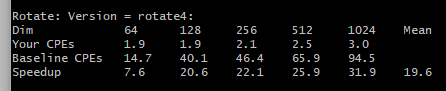
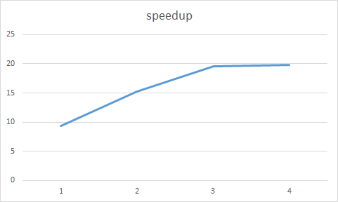

#	CSAPP-Lab2:PerfLab

姓名：龚***

学号：PB17***8

## 摘要

本报告是对**计算机系统详解**课程课后实验----**CSAPP相关实验**的**实验过程记录**以及**心得体会报告**。这次完成的实验是PerLab，考察的是对体系结构的理解程度，综合运用各种能力加速程序。

> INTRODUCTION
>
> This assignment deals with optimizing memory intensive code. Image processing offers many examples offunctions that can benefit from optimization. In this lab, we will consider two image processing operations:rotate, which rotates an image counter-clockwise by90◦, andsmooth, which “smooths” or “blurs” animage.

## 实验任务

完成对**rotate函数**和**smooth函数**的优化

> rotate function: rotate an image counter-clockwise by 90◦


> smooth function:  “smooth” or “blur” animage.
>
> The smooth operation is implemented by replacing every pixel value with the average of all the pixelsaround it.


##  实验过程

### Part1: rotate function optimization

原函数

```c
#define RIDX(i,j,n) ((i)*(n)+(j))
void naive_rotate(int dim, pixel *src, pixel *dst) 
{
    int i, j;
    for (i = 0; i < dim; i++)
	for (j = 0; j < dim; j++)
	    dst[RIDX(dim-1-j, i, dim)] = src[RIDX(i, j, dim)];
}
```

这是一个比较常规**类转置操作**，对**caches命中**比较敏感。

* 这里我们可以先测试下，是对src按行顺序读、对dst按列写性能好，还是对src按列读，对dst按行顺序写好。

相应的代码

```c
//对src按列读，对dst按行顺序写
void rotate1(int dim, pixel *src, pixel *dst) 
{
    int i, j;
	int k;
    for (j = 0; j < dim; j++){ 
		k = (dim - 1 - j) * dim;
		for (i = 0; i < dim; i++)
			dst[k + i] = src[i * dim + j]; 
	}
}
```

测试结果为：


可以看到speedup从baseline的9.4提升到15.3。

**对dst的顺序写**，可以更好地调高caches命中率。

* 另外，我们还可以对矩阵进行**分块**，从而提高数据的局部性，进一步提高caches的命中率

通过不断测试发现分块大小取32*32效果最佳。

```c
void rotate4(int dim, pixel *src, pixel *dst) 
{
    int i, j, k, h;
	int block = 32;
	int b = dim / block;
	int para = (b-1) * block;
	int p_d, p_s;
	for(i = 0; i < dim; i+=block){
		for(j = 0; j < dim; j+=block){
			p_d = (para - j) * dim + i;
			p_s = i * dim + j;
			for(k = 0; k < block; k++){
				for(h = 0; h < block; h++){
					dst[ p_d + (block - k - 1) * dim + h]= src[p_s + h * dim + k];
				}
			}
		}
	}
}
```

结果：



speedup从15.3提升到19.6

* 此时还可以进行**循环展开**，减小循环判断的开销，但是循环展开过多会导致寄存器不够用、数据局部性变差、caches missing增加，可以也会导致性能变差。

测试发现，两层展开效果较好。

```c
void rotate5(int dim, pixel *src, pixel *dst) 
{
    int i, j, k, h;
	int block = 32;
	int para = dim - block;
	int p_d, p_s;
	for(i = 0; i < dim; i+=block){
		for(j = 0; j < dim; j+=block){
			p_d = (para - j) * dim + i;
			p_s = i * dim + j;
			for(k = 0; k < block; k++){
				for(h = 0; h < block; h+=2){
					dst[p_d + (block - k - 1) * dim + h]= src[p_s + h * dim + k];
					dst[p_d + (block - k - 1) * dim + h + 1]= src[p_s + h * dim + k + dim];
				}
			}
		}
	}
}
```

结果：


性能有些许上升。

经过比较简单的优化，rotate性能已经提升了两倍多。

事实上，如果rotate矩阵规模更大一些，则可以尝试使用openmp进行多线程操作。但正在本次实验中，由于矩阵规模最大才为1024*1024，多线程引入所带来的jion、fork等额外开销对程序的影响更大。




​							rotate函数优化speedup记录图

###	Part2: smooth function optimization

原函数

```c
/* A struct used to compute averaged pixel value */
typedef struct {
    int red;
    int green;
    int blue;
    int num;
} pixel_sum;

/* Compute min and max of two integers, respectively */
static int min(int a, int b) { return (a < b ? a : b); }
static int max(int a, int b) { return (a > b ? a : b); }

/* 
 * initialize_pixel_sum - Initializes all fields of sum to 0 
 */
static void initialize_pixel_sum(pixel_sum *sum) 
{
    sum->red = sum->green = sum->blue = 0;
    sum->num = 0;
    return;
}

/* 
 * accumulate_sum - Accumulates field values of p in corresponding 
 * fields of sum 
 */
static void accumulate_sum(pixel_sum *sum, pixel p) 
{
    sum->red += (int) p.red;
    sum->green += (int) p.green;
    sum->blue += (int) p.blue;
    sum->num++;
    return;
}

/* 
 * assign_sum_to_pixel - Computes averaged pixel value in current_pixel 
 */
static void assign_sum_to_pixel(pixel *current_pixel, pixel_sum sum) 
{
    current_pixel->red = (unsigned short) (sum.red/sum.num);
    current_pixel->green = (unsigned short) (sum.green/sum.num);
    current_pixel->blue = (unsigned short) (sum.blue/sum.num);
    return;
}

/* 
 * avg - Returns averaged pixel value at (i,j) 
 */
static pixel avg(int dim, int i, int j, pixel *src) 
{
    int ii, jj;
    pixel_sum sum;
    pixel current_pixel;

    initialize_pixel_sum(&sum);
    for(ii = max(i-1, 0); ii <= min(i+1, dim-1); ii++) 
	for(jj = max(j-1, 0); jj <= min(j+1, dim-1); jj++) 
	    accumulate_sum(&sum, src[RIDX(ii, jj, dim)]);

    assign_sum_to_pixel(&current_pixel, sum);
    return current_pixel;
}

/******************************************************
 * Your different versions of the smooth kernel go here
 ******************************************************/

/*
 * naive_smooth - The naive baseline version of smooth 
 */
char naive_smooth_descr[] = "naive_smooth: Naive baseline implementation";
void naive_smooth(int dim, pixel *src, pixel *dst) 
{
    int i, j;

    for (i = 0; i < dim; i++)
	for (j = 0; j < dim; j++)
	    dst[RIDX(i, j, dim)] = avg(dim, i, j, src);
}
```

* 首先，我们可以发现，原函数中有着大量的冗余计算，可以尝试去除冗余，减少计算量。

```c
void smooth1(int dim, pixel *src, pixel *dst){
	int i, j;
	int red,green,blue,num;
	p_sum sum[512 * 512];
	for(i = 0; i < dim; i++){
		for(j = 0; j < dim; j++){
			red = 0;
			green = 0;
			blue = 0;
			for(int k = max(i-1, 0); k <= min(i+1, dim-1); k++){
				red += (int)src[RIDX(k,j,dim)].red;
				green += (int)src[RIDX(k,j,dim)].green;
				blue += (int)src[RIDX(k,j,dim)].blue;
			}
				sum[RIDX(i, j, dim)].red = red;
				sum[RIDX(i, j, dim)].green = green;
				sum[RIDX(i, j, dim)].blue = blue;
		}
	}
	
	for(i = 0; i < dim; i++){
		for(j = 0; j < dim; j++){
			red = 0;
			green = 0;
			blue = 0;
			for(int k = max(j-1, 0); k <= min(j+1, dim - 1); k++){
				red += sum[RIDX(i, k, dim)].red;
				green += sum[RIDX(i, k, dim)].green;
				blue += sum[RIDX(i, k, dim)].blue;
			}
			
			if((i == 0 || i == dim - 1) && (j == 0 || j == dim - 1))
				num = 4;
			else if( i == 0 || i == dim - 1 || j == 0 || j == dim - 1)
				num = 6;
			else	
				num = 9;
			
			dst[RIDX(i, j, dim)].red = (unsigned short)(red/num);
			dst[RIDX(i, j, dim)].green = (unsigned short)(green/num);
			dst[RIDX(i, j, dim)].blue = (unsigned short)(blue/num);
		}
	}	
}
```

* 接下来，可以把展开循环，减少分支判断

```c
void smooth5(int dim, pixel *src, pixel *dst){
	int i, j;
	int num;
	pixel_sum sum[541 * 541];
	
	for(i = 0; i < dim; i++){
		sum[RIDX(i, 0, dim)].red = src[RIDX(i, 0, dim)].red 
            					 + src[RIDX(i, 1, dim)].red;
		sum[RIDX(i, 0, dim)].green = src[RIDX(i, 0, dim)].green 
            					   + src[RIDX(i, 1, dim)].green;
		sum[RIDX(i, 0, dim)].blue = src[RIDX(i, 0, dim)].blue 
            					  + src[RIDX(i, 1, dim)].blue;
		sum[RIDX(i, 0, dim)].num = 2;
			
		for(j = 1; j < dim - 1; j++){
			sum[RIDX(i, j, dim)].red = src[RIDX(i, j-1, dim)].red 
                					+ src[RIDX(i, j, dim)].red 
                					+ src[RIDX(i, j+1, dim)].red;
			sum[RIDX(i, j, dim)].green = src[RIDX(i, j-1, dim)].green 
                						+ src[RIDX(i, j, dim)].green 
                						+ src[RIDX(i, j+1, dim)].green;
			sum[RIDX(i, j, dim)].blue = src[RIDX(i, j-1, dim)].blue 
                					+ src[RIDX(i, j, dim)].blue 
                					+ src[RIDX(i, j+1, dim)].blue;
			sum[RIDX(i, j, dim)].num = 3;
		}
			
		sum[RIDX(i,  dim-1, dim)].red = src[RIDX(i,  dim-1, dim)].red 
            						+ src[RIDX(i, dim-2, dim)].red;
		sum[RIDX(i,  dim-1, dim)].green = src[RIDX(i,  dim-1, dim)].green 
            						+ src[RIDX(i, dim-2, dim)].green;
		sum[RIDX(i,  dim-1, dim)].blue = src[RIDX(i,  dim-1, dim)].blue 
            						+ src[RIDX(i, dim-2, dim)].blue;
		sum[RIDX(i,  dim-1, dim)].num = 2;

	}
	

		
	for(j = 0; j < dim; j++){
 		num = sum[RIDX(0, j, dim)].num + sum[RIDX(1, j, dim)].num;
		dst[RIDX(0, j, dim)].red = (unsigned short)((sum[RIDX(0, j, dim)].red + sum[RIDX(1, j, dim)].red)/num);
		dst[RIDX(0, j, dim)].green = (unsigned short)((sum[RIDX(0, j, dim)].green + sum[RIDX(1, j, dim)].green)/num);
		dst[RIDX(0, j, dim)].blue = (unsigned short)((sum[RIDX(0, j, dim)].blue + sum[RIDX(1, j, dim)].blue)/num);
		
		for(i = 1; i < dim-1; i++){
			num = sum[RIDX(i-1, j, dim)].num + sum[RIDX(i, j, dim)].num+ sum[RIDX(i+1, j, dim)].num;
			dst[RIDX(i, j, dim)].red = (unsigned short)((sum[RIDX(i-1, j, dim)].red + sum[RIDX(i, j, dim)].red + sum[RIDX(i+1, j, dim)].red)/num);
			dst[RIDX(i, j, dim)].green = (unsigned short)((sum[RIDX(i-1, j, dim)].green + sum[RIDX(i, j, dim)].green + sum[RIDX(i+1, j, dim)].green)/num);
			dst[RIDX(i, j, dim)].blue = (unsigned short)((sum[RIDX(i-1, j, dim)].blue + sum[RIDX(i, j, dim)].blue + sum[RIDX(i+1, j, dim)].blue)/num);
			}
						
		num = sum[RIDX(dim-1, j, dim)].num + sum[RIDX(dim-1, j, dim)].num;
		dst[RIDX(dim-1, j, dim)].red = (unsigned short)((sum[RIDX(dim-1, j, dim)].red + sum[RIDX(dim-2, j, dim)].red)/num);
		dst[RIDX(dim-1, j, dim)].green = (unsigned short)((sum[RIDX(dim-1, j, dim)].green + sum[RIDX(dim-2, j, dim)].green)/num) ;
		dst[RIDX(dim-1, j, dim)].blue = (unsigned short)((sum[RIDX(dim-1, j, dim)].blue + sum[RIDX(dim-2, j, dim)].blue)/num) ;
	}
				
}
```

* 最后，由于对矩阵经常按列进行读取，为了降低caches missing，我们可以把sum开成二维数组，同时维度开稍微大些

```c
void smooth9(int dim, pixel *src, pixel *dst)
{
    pixel_sum sum[530][513];
    int i, j, num;
    for(i=0;i<dim; i++)
    {
       sum[i][0].red = (src[RIDX(i, 0, dim)].red+src[RIDX(i, 1, dim)].red);
       sum[i][0].blue = (src[RIDX(i, 0, dim)].blue+src[RIDX(i, 1,dim)].blue);
       sum[i][0].green = (src[RIDX(i, 0, dim)].green+src[RIDX(i, 1,dim)].green);
       sum[i][0].num = 2;
       
	   for(j=1;j<dim-1; j++)
        {
           sum[i][j].red = (src[RIDX(i, j-1, dim)].red+src[RIDX(i, j,dim)].red+src[RIDX(i, j+1, dim)].red);
           sum[i][j].blue = (src[RIDX(i, j-1, dim)].blue+src[RIDX(i, j,dim)].blue+src[RIDX(i, j+1, dim)].blue);
           sum[i][j].green = (src[RIDX(i, j-1, dim)].green+src[RIDX(i, j,dim)].green+src[RIDX(i, j+1, dim)].green);
           sum[i][j].num = 3;
        }
       
	   sum[i][dim-1].red = (src[RIDX(i, dim-2, dim)].red+src[RIDX(i, dim-1,dim)].red);
       sum[i][dim-1].blue = (src[RIDX(i, dim-2, dim)].blue+src[RIDX(i,dim-1, dim)].blue);
       sum[i][dim-1].green = (src[RIDX(i, dim-2, dim)].green+src[RIDX(i,dim-1, dim)].green);
       sum[i][dim-1].num = 2;
    }
    for(j=0;j<dim; j++)
    {
        num =sum[0][j].num+sum[1][j].num;
        dst[RIDX(0,j, dim)].red = (unsigned short)((sum[0][j].red+sum[1][j].red)/num);
        dst[RIDX(0,j, dim)].blue = (unsigned short)((sum[0][j].blue+sum[1][j].blue)/num);
        dst[RIDX(0,j, dim)].green = (unsigned short)((sum[0][j].green+sum[1][j].green)/num);
        
		for(i=1;i<dim-1; i++)
        {
           num =sum[i-1][j].num+sum[i][j].num+sum[i+1][j].num;
           dst[RIDX(i, j, dim)].red = (unsigned short)((sum[i-1][j].red+sum[i][j].red+sum[i+1][j].red)/num);
           dst[RIDX(i, j, dim)].blue = (unsigned short)((sum[i-1][j].blue+sum[i][j].blue+sum[i+1][j].blue)/num);
           dst[RIDX(i, j, dim)].green = (unsigned short)((sum[i-1][j].green+sum[i][j].green+sum[i+1][j].green)/num);
        }
       
	   num =sum[dim-1][j].num+sum[dim-2][j].num;
       dst[RIDX(dim-1, j, dim)].red = (unsigned short)((sum[dim-2][j].red+sum[dim-1][j].red)/num);
       dst[RIDX(dim-1, j, dim)].blue = (unsigned short)((sum[dim-2][j].blue+sum[dim-1][j].blue)/num);
       dst[RIDX(dim-1, j, dim)].green = (unsigned short)((sum[dim-2][j].green+sum[dim-1][j].green)/num);
    }
}
```


主要原因：

最终实验结果：


从最初的12.0->19.4->20.9->25.2->29.8

##	实验总结

1. 对程序的优化实质上考察的是程序员对计算机系统以及所在平台的相关特性的理解程度，优化过程实质是一个反复权衡掂量的过程。

2. 我写报告的能力真差。：（
