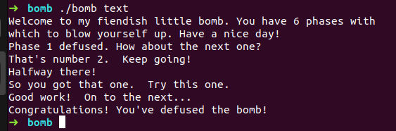

#	CSAPP-Lab3：Bomb Lab

姓名：龚***

学号：PB17***8

##	摘要

本报告是对**计算机系统详解**课程课后实验----**CSAPP相关实验**的实验思路汇总以及心得体会报告。这次完成的实验是Bomb Lab，主要考察对几种常见的操作的x86汇编代码的了解程度和linux debug tool gdb的使用。

##	实验任务

拆除所有炸弹

> Introduction of bomb lab
>
> The nefarious Dr. Evilhas planted a slew of “binary bombs” on our class machines.  A binary bomb is aprogram that consists of a sequence of phases. Each phase expects you to type a particular string onstdin.If you type the correct string, then the phase isdefusedand the bomb proceeds to the next phase. Otherwise,the bombexplodesby printing"BOOM!!!" and then terminating.  The bomb is defused when every phasehas been defused.
>
> There  are  too  many bombs  for  us  to deal  with,  so  we are giving  each  student  a bomb  to  defuse.   Yourmission, which you have no choice but to accept, is to defuse your bomb before the due date.  Good luck,and welcome to the bomb squad!

##	实验过程

###	预处理

利用objdump对执行文件进行反汇编

```shell
objdump -D bomb > bomb.asm
```

###	phase_1

```assembly
0000000000400ee0 <phase_1>:
  400ee0:	48 83 ec 08          	sub    $0x8,%rsp
  400ee4:	be 00 24 40 00       	mov    $0x402400,%esi
  400ee9:	e8 4a 04 00 00       	callq  401338 <strings_not_equal>
  400eee:	85 c0                	test   %eax,%eax
  400ef0:	74 05                	je     400ef7 <phase_1+0x17>
  400ef2:	e8 43 05 00 00       	callq  40143a <explode_bomb>
  400ef7:	48 83 c4 08          	add    $0x8,%rsp
  400efb:	c3                   	retq
```

函数strings_not_equal是对两字符串进行比较，利用寄存器%edi，%esi来传递函数参数，并用%eax传递返回值。

其中一个字符串首地址为0x402400，指向rodata section，其对应bytes为：

```assembly
42 6f 72 64 65 72 20 72 65 6c 61 74 69 6f 6e 73 20 77 69 74 68 20 43 61 6e 61 64 61 20 68 61 76 65 20 6e 65 76 65 72 20 62 65 65 6e 20 62 65 74 74 65 72 2e
```

转化为Ascii为：

```assembly
Border relations with Canada have never been better.
```

### phase_2

```assembly
0000000000400efc <phase_2>:
  400efc:	55                   	push   %rbp
  400efd:	53                   	push   %rbx
  400efe:	48 83 ec 28          	sub    $0x28,%rsp
  400f02:	48 89 e6             	mov    %rsp,%rsi
  400f05:	e8 52 05 00 00       	callq  40145c <read_six_numbers>
  400f0a:	83 3c 24 01          	cmpl   $0x1,(%rsp)
  400f0e:	74 20                	je     400f30 <phase_2+0x34>
  400f10:	e8 25 05 00 00       	callq  40143a <explode_bomb>
  400f15:	eb 19                	jmp    400f30 <phase_2+0x34>
  400f17:	8b 43 fc             	mov    -0x4(%rbx),%eax
  400f1a:	01 c0                	add    %eax,%eax
  400f1c:	39 03                	cmp    %eax,(%rbx)
  400f1e:	74 05                	je     400f25 <phase_2+0x29>
  400f20:	e8 15 05 00 00       	callq  40143a <explode_bomb>
  400f25:	48 83 c3 04          	add    $0x4,%rbx
  400f29:	48 39 eb             	cmp    %rbp,%rbx
  400f2c:	75 e9                	jne    400f17 <phase_2+0x1b>
  400f2e:	eb 0c                	jmp    400f3c <phase_2+0x40>
  400f30:	48 8d 5c 24 04       	lea    0x4(%rsp),%rbx
  400f35:	48 8d 6c 24 18       	lea    0x18(%rsp),%rbp
  400f3a:	eb db                	jmp    400f17 <phase_2+0x1b>
  400f3c:	48 83 c4 28          	add    $0x28,%rsp
  400f40:	5b                   	pop    %rbx
  400f41:	5d                   	pop    %rbp
  400f42:	c3                   	retq   
```

由注释等信息易知，此函数输入六个integer，我们对函数内循环进行分析，可以发现每个数都是它直接前驱的两倍且第一个数是1

所以对应的字符串为：

```assembly
1 2 4 8 16 32
```

###	phase_3

```assembly
0000000000400f43 <phase_3>:
  400f43:	48 83 ec 18          	sub    $0x18,%rsp
  400f47:	48 8d 4c 24 0c       	lea    0xc(%rsp),%rcx
  400f4c:	48 8d 54 24 08       	lea    0x8(%rsp),%rdx
  400f51:	be cf 25 40 00       	mov    $0x4025cf,%esi
  400f56:	b8 00 00 00 00       	mov    $0x0,%eax
  400f5b:	e8 90 fc ff ff       	callq  400bf0 <__isoc99_sscanf@plt>
  400f60:	83 f8 01             	cmp    $0x1,%eax
  400f63:	7f 05                	jg     400f6a <phase_3+0x27>
  400f65:	e8 d0 04 00 00       	callq  40143a <explode_bomb>
  400f6a:	83 7c 24 08 07       	cmpl   $0x7,0x8(%rsp)
  400f6f:	77 3c                	ja     400fad <phase_3+0x6a>
  400f71:	8b 44 24 08          	mov    0x8(%rsp),%eax
  400f75:	ff 24 c5 70 24 40 00 	jmpq   *0x402470(,%rax,8)
  400f7c:	b8 cf 00 00 00       	mov    $0xcf,%eax
  400f81:	eb 3b                	jmp    400fbe <phase_3+0x7b>
  400f83:	b8 c3 02 00 00       	mov    $0x2c3,%eax
  400f88:	eb 34                	jmp    400fbe <phase_3+0x7b>
  400f8a:	b8 00 01 00 00       	mov    $0x100,%eax
  400f8f:	eb 2d                	jmp    400fbe <phase_3+0x7b>
  400f91:	b8 85 01 00 00       	mov    $0x185,%eax
  400f96:	eb 26                	jmp    400fbe <phase_3+0x7b>
  400f98:	b8 ce 00 00 00       	mov    $0xce,%eax
  400f9d:	eb 1f                	jmp    400fbe <phase_3+0x7b>
  400f9f:	b8 aa 02 00 00       	mov    $0x2aa,%eax
  400fa4:	eb 18                	jmp    400fbe <phase_3+0x7b>
  400fa6:	b8 47 01 00 00       	mov    $0x147,%eax
  400fab:	eb 11                	jmp    400fbe <phase_3+0x7b>
  400fad:	e8 88 04 00 00       	callq  40143a <explode_bomb>
  400fb2:	b8 00 00 00 00       	mov    $0x0,%eax
  400fb7:	eb 05                	jmp    400fbe <phase_3+0x7b>
  400fb9:	b8 37 01 00 00       	mov    $0x137,%eax
  400fbe:	3b 44 24 0c          	cmp    0xc(%rsp),%eax
  400fc2:	74 05                	je     400fc9 <phase_3+0x86>
  400fc4:	e8 71 04 00 00       	callq  40143a <explode_bomb>
  400fc9:	48 83 c4 18          	add    $0x18,%rsp
  400fcd:	c3                   	retq   
```

phase_3函数中反复出现 jmp    400fbe <phase_3+0x7b> 指令，易判断这是一个C语言中的case语句。每个case都对应一个答案，共有8中情况：

```assembly
0 207
1 311
2 707
3 256
4 389
5 206
6 682
7 327
```

每种情况都能通过

### phase_4

```assembly
0000000000400fce <func4>:
  400fce:	48 83 ec 08          	sub    $0x8,%rsp
  400fd2:	89 d0                	mov    %edx,%eax
  400fd4:	29 f0                	sub    %esi,%eax
  400fd6:	89 c1                	mov    %eax,%ecx
  400fd8:	c1 e9 1f             	shr    $0x1f,%ecx
  400fdb:	01 c8                	add    %ecx,%eax
  400fdd:	d1 f8                	sar    %eax
  400fdf:	8d 0c 30             	lea    (%rax,%rsi,1),%ecx
  400fe2:	39 f9                	cmp    %edi,%ecx
  400fe4:	7e 0c                	jle    400ff2 <func4+0x24>
  400fe6:	8d 51 ff             	lea    -0x1(%rcx),%edx
  400fe9:	e8 e0 ff ff ff       	callq  400fce <func4>
  400fee:	01 c0                	add    %eax,%eax
  400ff0:	eb 15                	jmp    401007 <func4+0x39>
  400ff2:	b8 00 00 00 00       	mov    $0x0,%eax
  400ff7:	39 f9                	cmp    %edi,%ecx
  400ff9:	7d 0c                	jge    401007 <func4+0x39>
  400ffb:	8d 71 01             	lea    0x1(%rcx),%esi
  400ffe:	e8 cb ff ff ff       	callq  400fce <func4>
  401003:	8d 44 00 01          	lea    0x1(%rax,%rax,1),%eax
  401007:	48 83 c4 08          	add    $0x8,%rsp
  40100b:	c3                   	retq   

000000000040100c <phase_4>:
  40100c:	48 83 ec 18          	sub    $0x18,%rsp
  401010:	48 8d 4c 24 0c       	lea    0xc(%rsp),%rcx
  401015:	48 8d 54 24 08       	lea    0x8(%rsp),%rdx
  40101a:	be cf 25 40 00       	mov    $0x4025cf,%esi
  40101f:	b8 00 00 00 00       	mov    $0x0,%eax
  401024:	e8 c7 fb ff ff       	callq  400bf0 <__isoc99_sscanf@plt>
  401029:	83 f8 02             	cmp    $0x2,%eax
  40102c:	75 07                	jne    401035 <phase_4+0x29>
  40102e:	83 7c 24 08 0e       	cmpl   $0xe,0x8(%rsp)
  401033:	76 05                	jbe    40103a <phase_4+0x2e>
  401035:	e8 00 04 00 00       	callq  40143a <explode_bomb>
  40103a:	ba 0e 00 00 00       	mov    $0xe,%edx
  40103f:	be 00 00 00 00       	mov    $0x0,%esi
  401044:	8b 7c 24 08          	mov    0x8(%rsp),%edi
  401048:	e8 81 ff ff ff       	callq  400fce <func4>
  40104d:	85 c0                	test   %eax,%eax
  40104f:	75 07                	jne    401058 <phase_4+0x4c>
  401051:	83 7c 24 0c 00       	cmpl   $0x0,0xc(%rsp)
  401056:	74 05                	je     40105d <phase_4+0x51>
  401058:	e8 dd 03 00 00       	callq  40143a <explode_bomb>
  40105d:	48 83 c4 18          	add    $0x18,%rsp
  401061:	c3                   	retq   
```

phase_4说实话没怎么看懂。主要是没有搞懂其调用的func4函数的功能。

易判断输入的字符为两个integer，第一个integer小于15且第二个integer为0；还要求func4的返回值为0。对func4简单进行查看，但输入参数为0是返回0。

所以一个解为：

```assembly
0	0
```

### phase_5

```assembly
0000000000401062 <phase_5>:
  401062:	53                   	push   %rbx
  401063:	48 83 ec 20          	sub    $0x20,%rsp
  401067:	48 89 fb             	mov    %rdi,%rbx
  40106a:	64 48 8b 04 25 28 00 	mov    %fs:0x28,%rax
  401071:	00 00 
  401073:	48 89 44 24 18       	mov    %rax,0x18(%rsp)
  401078:	31 c0                	xor    %eax,%eax
  40107a:	e8 9c 02 00 00       	callq  40131b <string_length>
  40107f:	83 f8 06             	cmp    $0x6,%eax
  401082:	74 4e                	je     4010d2 <phase_5+0x70>
  401084:	e8 b1 03 00 00       	callq  40143a <explode_bomb>
  401089:	eb 47                	jmp    4010d2 <phase_5+0x70>
  40108b:	0f b6 0c 03          	movzbl (%rbx,%rax,1),%ecx
  40108f:	88 0c 24             	mov    %cl,(%rsp)
  401092:	48 8b 14 24          	mov    (%rsp),%rdx
  401096:	83 e2 0f             	and    $0xf,%edx
  401099:	0f b6 92 b0 24 40 00 	movzbl 0x4024b0(%rdx),%edx
  4010a0:	88 54 04 10          	mov    %dl,0x10(%rsp,%rax,1)
  4010a4:	48 83 c0 01          	add    $0x1,%rax
  4010a8:	48 83 f8 06          	cmp    $0x6,%rax
  4010ac:	75 dd                	jne    40108b <phase_5+0x29>
  4010ae:	c6 44 24 16 00       	movb   $0x0,0x16(%rsp)
  4010b3:	be 5e 24 40 00       	mov    $0x40245e,%esi
  4010b8:	48 8d 7c 24 10       	lea    0x10(%rsp),%rdi
  4010bd:	e8 76 02 00 00       	callq  401338 <strings_not_equal>
  4010c2:	85 c0                	test   %eax,%eax
  4010c4:	74 13                	je     4010d9 <phase_5+0x77>
  4010c6:	e8 6f 03 00 00       	callq  40143a <explode_bomb>
  4010cb:	0f 1f 44 00 00       	nopl   0x0(%rax,%rax,1)
  4010d0:	eb 07                	jmp    4010d9 <phase_5+0x77>
  4010d2:	b8 00 00 00 00       	mov    $0x0,%eax
  4010d7:	eb b2                	jmp    40108b <phase_5+0x29>
  4010d9:	48 8b 44 24 18       	mov    0x18(%rsp),%rax
  4010de:	64 48 33 04 25 28 00 	xor    %fs:0x28,%rax
  4010e5:	00 00 
  4010e7:	74 05                	je     4010ee <phase_5+0x8c>
  4010e9:	e8 42 fa ff ff       	callq  400b30 <__stack_chk_fail@plt>
  4010ee:	48 83 c4 20          	add    $0x20,%rsp
  4010f2:	5b                   	pop    %rbx
  4010f3:	c3                   	retq   
```

phase_5是输入长度为6的一个字符串且存在字符比较。其中一个字符串对应的是“flyers”。

输入字符安装先按照一个字符数组对应成一个新的字符，再将新字符与“flyers”进行比较。

转化公式大意为：

```assembly
new char = char_array[old char $ 0xF]
```

这个char_array一部分为：

```assembly
61 64 75 69 6d 65 72 73 6e 66 6f 74 76 62 79 6c 53 6f 20  #16进制
 a  d  u  i  m  e  r  s  n  f  o  t  v  b  y  l  S  o     #Ascii
 0  1  2  3  4  5  6  7  8  9 10 11 12 13 14 15 16 17	  #index
```

要对应到“flyers”就要求输入的字符最后4个bit为：

```assembly
9 15 14 5 6 7
```

然后将其高4bit设置为6使其映射为Ascii字母，方便输入，即为：

```assembly
69 6f 6e 65 66 67
 i  o  n  e  f  g
ionefg  #最终答案
```

### phase_6

phase_6考察链表操作，大致意思是根据输入六个不同且大小介于0到6的integer，来对相关节点进行排序，且要求最终结果从大到小。

node信息：

```assembly
00000000006032d0 <node1>:
  6032d0:	4c 01 00             	add    %r8,(%rax)
  6032d3:	00 01                	add    %al,(%rcx)
  6032d5:	00 00                	add    %al,(%rax)
  6032d7:	00 e0                	add    %ah,%al
  6032d9:	32 60 00             	xor    0x0(%rax),%ah
  6032dc:	00 00                	add    %al,(%rax)
	...

00000000006032e0 <node2>:
  6032e0:	a8 00                	test   $0x0,%al
  6032e2:	00 00                	add    %al,(%rax)
  6032e4:	02 00                	add    (%rax),%al
  6032e6:	00 00                	add    %al,(%rax)
  6032e8:	f0 32 60 00          	lock xor 0x0(%rax),%ah
  6032ec:	00 00                	add    %al,(%rax)
	...

00000000006032f0 <node3>:
  6032f0:	9c                   	pushfq 
  6032f1:	03 00                	add    (%rax),%eax
  6032f3:	00 03                	add    %al,(%rbx)
  6032f5:	00 00                	add    %al,(%rax)
  6032f7:	00 00                	add    %al,(%rax)
  6032f9:	33 60 00             	xor    0x0(%rax),%esp
  6032fc:	00 00                	add    %al,(%rax)
	...

0000000000603300 <node4>:
  603300:	b3 02                	mov    $0x2,%bl
  603302:	00 00                	add    %al,(%rax)
  603304:	04 00                	add    $0x0,%al
  603306:	00 00                	add    %al,(%rax)
  603308:	10 33                	adc    %dh,(%rbx)
  60330a:	60                   	(bad)  
  60330b:	00 00                	add    %al,(%rax)
  60330d:	00 00                	add    %al,(%rax)
	...

0000000000603310 <node5>:
  603310:	dd 01                	fldl   (%rcx)
  603312:	00 00                	add    %al,(%rax)
  603314:	05 00 00 00 20       	add    $0x20000000,%eax
  603319:	33 60 00             	xor    0x0(%rax),%esp
  60331c:	00 00                	add    %al,(%rax)
	...

0000000000603320 <node6>:
  603320:	bb 01 00 00 06       	mov    $0x6000001,%ebx
  
# 332 store in node1 
# 168 store in node2
# 924 store in node3
# 691 store in node4
# 477 store in node5
# 443 store in node6
```

所以排序结果应为：

```assembly
3 4 5 6 1 2
```

又因为之前有一个7-x操作，所以输入应为：

```assembly
4 3 2 1 6 5
```

##	结果

 我们将所有结果存入text文本中


运行

```assembly
./bomb text
```

最终结果

